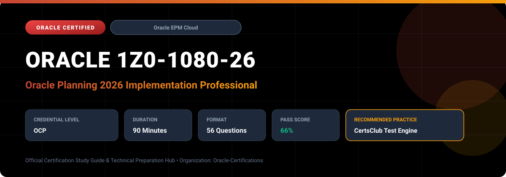

  

# Oracle 1Z0-1080-26: Oracle Planning 2026 Implementation Professional

---

## 1. Exam Overview & Candidate Profile

The **Oracle 1Z0-1080-26: Oracle Planning 2026 Implementation Professional** examination is engineered for enterprise architects, solution specialists, functional consultants, and implementation professionals seeking formal industry recognition of their proficiency in Oracle technologies.

The Oracle Planning 2026 Implementation Professional (1Z0-1080-26) certification certifies advanced technical skills in deploying and administrating Oracle Planning Cloud. It covers multi-cube architecture, financial budgeting and forecasting models, intelligent performance management (IPM), Groovy script development, and automated data pipelines.

### Target Audience & Prerequisites
- **Target Roles**: Implementation Specialists, Cloud Architects, Technical Leads, Enterprise Functional Consultants, and Systems Engineers.
- **Recommended Experience**: 1–2 years of practical, hands-on experience designing, implementing, and maintaining corresponding Oracle Cloud solutions.
- **Credential Earned**: Oracle Certified Professional (OCP).

---

## 2. Key Exam Specifications

| Specification | Details |
| :--- | :--- |
| **Exam Code** | **Oracle 1Z0-1080-26** |
| **Official Title** | Oracle Planning 2026 Implementation Professional |
| **Certification Track** | Oracle Enterprise Performance Management Cloud |
| **Exam Duration** | 90 Minutes |
| **Number of Questions** | 56 Questions |
| **Passing Score** | 66% |
| **Question Format** | Multiple Choice (Single/Multiple Answer), Scenario-Based Questions |
| **Delivery Provider** | Oracle University / Pearson VUE (Online Proctored or Test Center) |
| **Recommended Practice Engine** | [CertsClub Oracle Practice Tests](https://www.certsclub.com/oracle/1z0-1080-26-dumps.html) |

---

## 3. Official Blueprint & Exam Domain Breakdown

The examination assesses candidate competencies across core functional domains weighted as follows:

| Domain Area | Weighting |
| :--- | :--- |
| **Planning Architecture, Dimensions & Application Setup** | `25%` |
| **Configuring Pre-built Modules (Financials, Workforce, Capital, Projects)** | `25%` |
| **Business Rules, Calculation Manager & Groovy Scripting** | `20%` |
| **Data Integration, Forms, Dashboards & Navigation Flows** | `15%` |
| **Security, Approvals, Task Manager & Lifecycle Management** | `15%` |

---

## 4. Deep Dive into Complex & Challenging Technical Topics

To secure a passing score on the 1Z0-1080-26 exam, candidates must master the following advanced concepts:

- Designing hybrid aggregation cubes, dimension cache optimization, and smart lists.
- Developing advanced Groovy rules to dynamically manipulate grid data, validate inputs, and execute partial block calculations.
- Configuring IPM Insights to surface anomalies, patterns, and machine-learning predictions directly within user forms.
- EPM Automate scripting for routine dimension builds, data loads, rule executions, and automated backups.

---

## 5. Scenario-Based Demo & Practice Questions

### Question 1
In Oracle Planning Cloud, which scripting language enables developers to interact directly with web form grids, execute cell-level validations before save, and target calculation rules strictly to modified cells?

A) PL/SQL
B) Groovy Scripting
C) VBScript
D) XSLT

- **Correct Answer**: `B) Groovy Scripting`  
- **Technical Explanation**: Groovy scripting in Oracle EPM Cloud provides object-oriented access to web form grids, enabling dynamic cell manipulation, real-time input validations, and targeted calculation of only edited data slices.

---

### Question 2
Which utility is standardly used by administrators to automate command-line tasks such as importing data, exporting metadata, and running business rules in Oracle Planning Cloud?

A) EPM Automate
B) SQL*Loader
C) OTM Dispatcher
D) Dispatch Console

- **Correct Answer**: `A) EPM Automate`  
- **Technical Explanation**: EPM Automate is Oracle's specialized command-line utility designed for scheduling, automation, and remote administration of Oracle Enterprise Performance Management Cloud instances.

---

## 6. Recommended Preparation Strategy & Practice Testing Engine

Achieving certification in **Oracle 1Z0-1080-26** requires balanced theoretical study and scenario-based simulation practice:

1. **Review Oracle Documentation**: Master architecture guides, implementation workbooks, and administration manuals on the Oracle Help Center.
2. **Hands-on Lab Practice**: Execute real-world configuration, policy setup, and troubleshooting tasks in your cloud tenancy or test instance.
3. **Simulated Exam Drills**: Practice answering timed, scenario-based multiple-choice questions to familiarize yourself with the question formats, traps, and timing constraints.

### Practice With CertsClub
For realistic practice questions, updated dumps, and mock testing environments:
- **Resource**: [CertsClub Oracle Practice Test Engine](https://www.certsclub.com/oracle/1z0-1080-26-dumps.html)
- **Special Discount**: Use coupon code **`club20`** during checkout for an instant **20% discount** on all practice exam bundles and testing engines.

---

## 7. Official Documentation & References

- [Oracle University Certification Registry](https://education.oracle.com/)
- [Oracle Help Center Documentation Portal](https://docs.oracle.com/)
- [Oracle Cloud Infrastructure & Applications Guides](https://docs.oracle.com/en/cloud/)
- [CertsClub Oracle Certification Exam Practice](https://www.certsclub.com/oracle/1z0-1080-26-dumps.html)

---

## 8. SEO & Discovery Keywords

`oracle 1z0-1080-26, oracle 1z0-1080-26 exam, oracle 1z0-1080-26 dumps, 1Z0-1080-26 practice questions, 1Z0-1080-26 study guide, oracle 1z0-1080-26 syllabus, oracle planning 2026 implementation professional, certsclub 1z0-1080-26`
